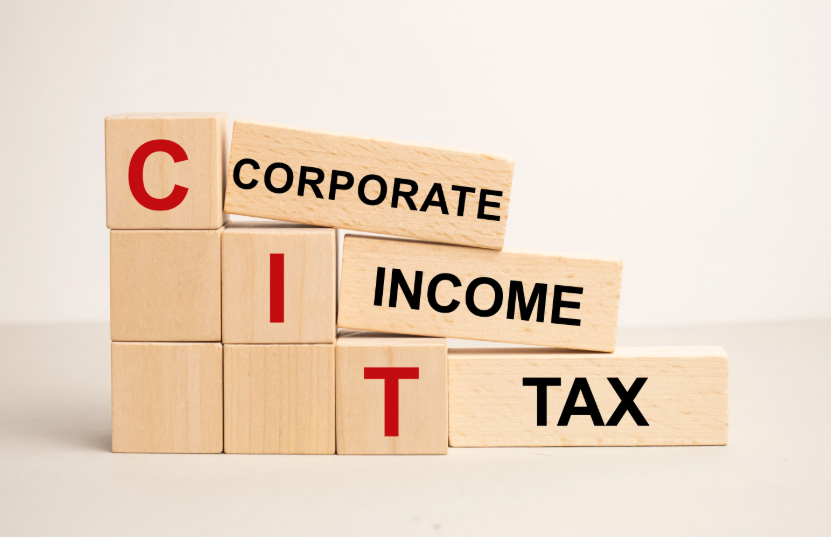
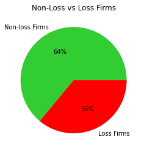
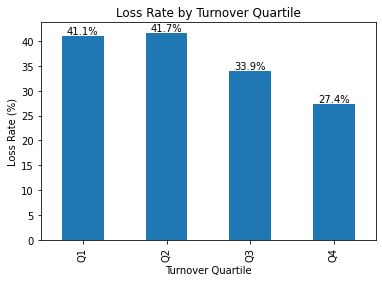
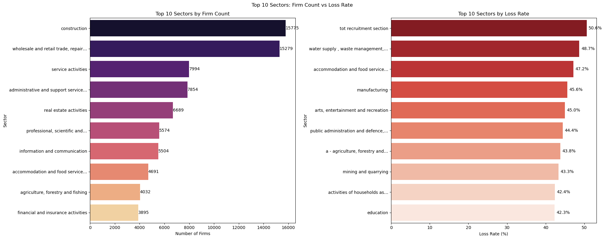
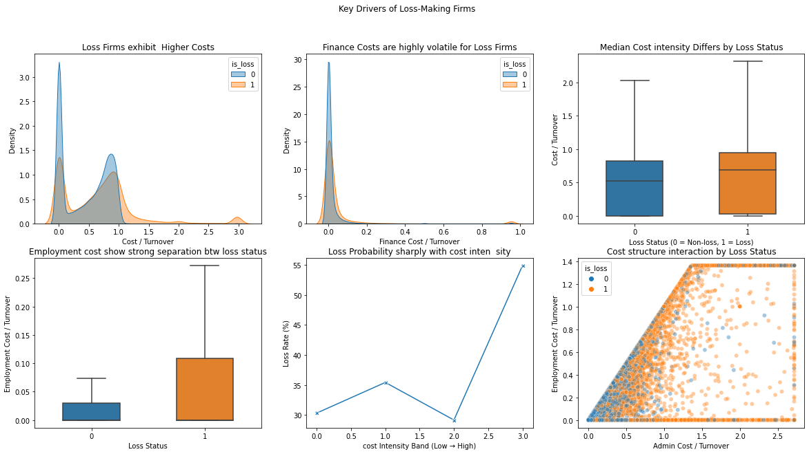

# PREDICTING CORPORATE TAX LOSS RISK IN KENYA
### Identifying High-risk firms for Enhanced Tax Compliance and Revenue Recovery

Authors: Brian Ndungu, Cyrus Mutuku, John Karanja, Catherine Gachiri, Fredrick Nzeve, Grace Kinyanjui and Jeremy Onsongo

Kenya's tax authority struggles to meet Corporate Income Tax (CIT) revenue targets because many firms report losses, shrinking the tax base. This project builds a machine learning model to predict which firms are likely to report losses based on theoretical financial charateristics like cost structure and spending patterns. Using 2024 tax return data from nearly 100,000 firms, we developed a predictive system that helps tax officers prioritize audits on high-risk companies, improving audit efficiency and revenue recovery.

## Business Understanding
### The problem

KRA is responsible for collecting national government revenue including a standard 30% Corporate Income Tax on resident companies. However, Kenya has consistently failed to meet CIT revenue targets. A major driver of this shortfall is the high prevalence of firms reporting losses, which significantly reduces the effective tax base and creates fiscal deficits.

The core issue is the lack of a data-driven framework to:
1. Identify which firm characteristics are linked to loss reporting
2. Proactively flag high-riskfirms and sectors for investigation
3. Understand how firm-level loss behaviour impacts overall tax revenue risk

Who are the benefactors?
1. KRA Compliance Directors - need a better way to select firms for audit. Manual selection misses high-risk loss-reporting firms, so a risk scoring system would improve audit targeting and recovery.

2. Tax policy Analysts - at the National Treasury struggle with revenue forecasting because they don't fully understand loss declaration patterns. Data-driven risk insights would improve budget accuracy.

3. Field Tax Officers - waste time auditing low-risk firms with minimal recovery potential. A prioritization tool would let them focus on companies with the highest evasion probability.

### Our solution
An automated risk scoring system that:

1. Processes firm-level CIT return data from the iTax platform
2. Builds interpretable predictive models starting with ligistic regression
3. Applies machine learning to identify high-risk loss-reporting firms
4. Translates individual firm risks into insights on aggregate tax revenue

## Data Understanding
### Dataset overview

We analyzed 2024 Corporate Income Tax return data containing:
- 313,870 firm-year observations across 61 variables
- 47 numeric variables (financial figures, costs, deductions)
- 14 categorical variables (sector, business type, filling status)
- Financial data from the iTax platform and electronic Tax Invoice Management System (eTIMS)

### Data Cleaning Steps
#### Initial Assessment:

- Started with 313,870 records and 61 columns
- Found 3,011 duplicate records which were removed
- Identified 49 columns out of the 61 with more than 60% missing values which were excluded from modelling

#### Standardization:

- Cleaned sector names and considered rare sectors into "Other" for easier data handling
- Converted core financial columns (turnover, profit, deductions) to numeric format
- Restricted analysis to active businesses with positive turnover

#### Final Modeling Sample:

- 99,491 firms with valid financial data
- 36% reported losses (roughly balanced dataset, which is why we did not use SMOTE analysis)

- Small firms (Q1 turnover) have the highest loss rates (41.1%), while large firms (Q4) have lowest (27.4%)

## Feature Engineering
We created seven key financial features that capture firms' cost structure and spending behaviour:

Sectors ranked by firm count and loss rate

Ratio Features
- Cost-to-Turnover ratio: Cost of sales divided by revenue (mean:0.532, most volatile ratio)
- Admin Cost ratio: Administrative expenses as % of revenue (mean:0.134)
- Employment Cost ratio: Payroll as % of revenue (mean:0.080)
- Finance Cost ratio: Fiancing costs as % of revenue (mean: 0.034, most stable)
- Deductions-to-Turnover ratio: Tax deductions as & of revenue (mean:0.035)

Structural flags
- High cost flag: Indivates if cost-to-turnover exceeds 90%
- Thin margin Flag: Marks firms with costs between 95-105% of revenue (near-loss)

Categorical Features
- Turnover Quartiles (Q1-Q4): Firm size categories based on revenue
- Sector: Industry classification (Construction, Retail, Services, etc)

Outlier Handling
Extreme values were capped at the 1st and 99th percentiles to prevent outliers from skewing the model:
- Cost-to-Turnover: capped at [0.0, 2.975]
- Admin Cost ratio: capped at [0.0, 2.718]
- Employment Cost ratio: capped at [0.0, 1.361]
- Finance Cost ratio: capped at [0.0, 0.952]
- Deductions-to-Turnover: capped at [0.0, 1.027]

This removed 159 invalid records leaving 99,332 firms ready for modeling.

### Data Preprocessing Pipeline
#### Numerical Features (7 variables):
- Imputation: Replace missing values with median
- Scaling: Standardize to zero mean and unit variance

#### Categorical Features (2 variables)
- Imputation: Replace missing values with most frequent category
- Encoding: One-Hot encode to convert categories to binary format

### Evaluation metrics
We used multiple metrics suited to imbalanced classification:

- ROC-AUC: Area under receiver operating characteristic curve
- Precision-Recall AUC: Balance between precision and Recall
- F1-Score: Mean of precision and recall
- Accuracy: Overall correctness
- Confusion Matrix: True positives, false positives, false negatives, true negatives

### Final Dataset
The cleaned and engineered dataset includes:

- 99,332 firms
- 10 final features (5 ratios + 2 flags + turnover quartile + sector + target)
- Saved as the final csv dataset for reproducibility

## Modeling and Evaluation
### Approach
Following the CRISP-DM method, these models were implemented:
#### Logistic Regression (the baseline model)
- Built an interpretable baseline model to understand the significance of our features.
- This model showed that firm size is a strong predictor. Smaller firms are more likely to report losses compared to large firms.
- We recorded an ROC-AUC performance of 0.76

#### Random Forest Classifier
- This model enabled us to capture complex, non-linear relationships between financial ratios and tax status.
- This model as expected outperformed the baseline, better handling outliers and interactions between sectors and cost structures.
- In terms of performance: 
We recorded an ROC-AUC score of 0.77 - meaning the model was good at distinguishing the different classes
PR-AUC score of 0.71 -meaning it was reliable at highlighting that sector differences also play a part in recording losses.

#### XGBoost
- The XGBoost model worked the best, as it gave us an ROC-AUC score of 0.8, which was the highest recorded ROC-AUC compared to other models.
- The model was really good when it came to finding the hidden patterns in our dataset, eg, it understood that a small construction company behaves very differently from a large bank, something that was missed by the previous models.
- With this model, we were able to narrow down on the key factors that contribute to losses:
1. High costs - if costs are 90% or more of sales, the risk of losses is very high
2. Industry/sector - Construction and Insurance companies report losses more than others
3. Company size - Huge companies have different loss patterns than small ones.

## Repository Navigation
Files included are:

- `CIT_Loss_Prediction-Notebook.ipynb` : the complete notebook with all the code, explanations and visuals
- `CIT2024.csv` : The raw dataset (the one with the initial 313,870 firms)
- `final_modeling_dataset.csv` : the cleaned and engineered dataset ready for modeling

## How to reproduce this analysis
### Requirements
- Python 3.8+
- Jupyter Notebook or any other coding platform
- Required packages: pandas, numpy, scikit-learn, matplotlib, seaborn, xgboost, joblib, statsmodels

### Steps
1. Clone or download the github repo
2. Install the required packages
3. Open the notebook and run all cells from top to bottom

### Key Findings
1. Loss is predictable: Firms' cost structures, spending ratios and size are significantly assiciated with loss reporting
2. Size matters: Small firms (Q1) have 41% loss rate vs 27% loss rate for large firms (Q4).
3. Cost volatility is telling: The cost-to-turnover ratio is the most variable feature, indicating different business models across the tax base
4. Balanced data: The 36% loss rate in our final sample means the model doesn't require us to use SMOTE.

### Recommendations
1. Segmented Compliance: Prioritize audit resources toward the Small Business segment (Q1) where the loss rate is disproportionately high (41%).
2. Anomaly Detection: Use cost-to-turnover ratios as a primary "red flag" indicator to detect potential expense overstatement.
3. System Integration: Integrate the predictive model into the iTax framework to provide real-time risk scores during the filing process

### Conclusion
This research successfully established a data-driven framework for predicting corporate income tax (CIT) loss risk within the Kenyan context. By leveraging machine learning to analyze administrative tax data, the project demonstrates that high-risk firms can be identified with significant precision, moving beyond the limitations of traditional, manual audit selection. Ultimately, the implementation of this model offers a scalable solution for the Kenya Revenue Authority to enhance compliance, optimize resource allocation for audits, and secure domestic revenue mobilization. It marks a critical step toward a more transparent and efficient tax administration system driven by predictive analytics.

